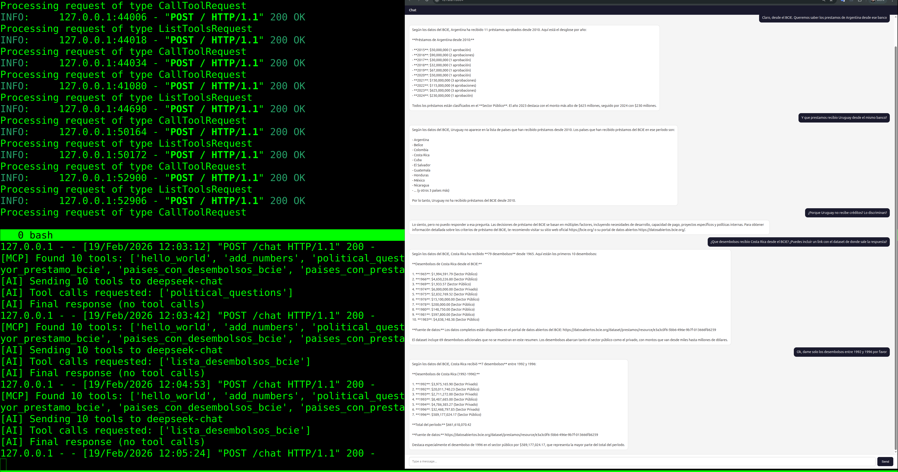

# MCP Chat Gateway

**IMPORTANT:** This is a simple application for testing and developing the
[OKFN MCP server](https://github.com/okfn/mcp-server). Prototyping and quick
changes are expected and code is mostly disposable.

A lightweight web chat interface that connects users to an AI provider (DeepSeek,
OpenAI, Ollama, or any OpenAI-compatible API) while giving the AI access to tools
served by an MCP server.

The AI answers questions exclusively using MCP tool data, not its own knowledge.

Zero frontend frameworks — plain HTML/JS/CSS. Backend is a minimal Flask app with no extra dependencies beyond httpx.

## MCP server

This tools was developed to work with, [OKFN MCP server](https://github.com/okfn/mcp-server)
but should work with any MCP server that implements the spec.

## Server + Client + Chat UI



### Development

Recommended to use `uv` as a package manager.

```bash
# Create a virtual environment and install dependencies
uv sync

# Activate the virtual environment
source .venv/bin/activate

# Configure your settings (choose one):
#   1. Edit local_settings.py with your AI_API_KEY and other overrides
#   2. Or set environment variables: AI_API_KEY, AI_BASE_URL, AI_MODEL, MCP_URL

# Run the server (port will be :8064)
python app.py

# Debug mode (port will be :5000)
flask run --debug
```

The chat UI is available at `http://127.0.0.1:8064`.

### Debug

To know exactly what's happening internally, see the [debug folder](debug/README.md).
